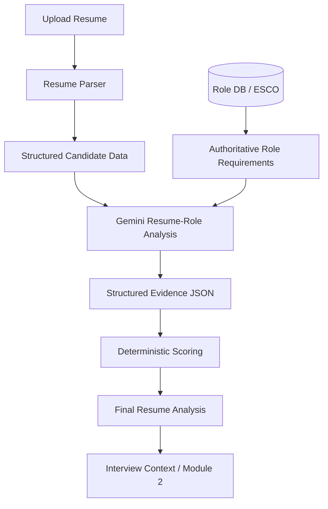

# AI-Powered Resume-Role Analysis Architecture

## Flow Architecture

## Responsibilities

1. **Resume Parser**:
   → Extracts factual candidate data (projects, skills, text, experience).

2. **Role Database / ESCO**:
   → Provides authoritative role requirements, skill taxonomy, priorities, and aliases.

3. **Deterministic Matcher**:
   → Performs factual baseline matching between the parsed profile and role requirements.

4. **Gemini**:
   → Deeply compares candidate evidence against role requirements for qualitative evidence interpretation (enrichment).

5. **Validation Layer**:
   → Validates Gemini's findings against the raw parsed text. Prevents unsupported AI claims and discards hallucinated evidence.

6. **Deterministic Scoring**:
   → Computes the final numeric score. Gemini does not control the final score; it only enriches the validated underlying evidence.

7. **Adaptive Interview (Module 2)**:
   → Consumes the validated strengths, skill gaps, and interview focus areas to drive personalized interview generation.

## Fallback & Hallucination Protection
- The system never trusts Gemini with the final numeric score.
- The `ai_analyzer.py` captures Gemini's findings, maps them to `MatchedArea` schemas, and overwrites the semantic matches.
- If Gemini is unavailable, rate-limited (e.g. QUOTA cooldown), or returns malformed data, `ResumeProcessingService` catches the exception and immediately falls back to the deterministic string-matcher, tagging `analysis_source = "deterministic"`.

## API Contract & Integration
The standard `Module1Output` schema has been extended with:
- `ai_analysis`: Full AI analysis blob
- `analysis_source`: E.g., `"gemini"` or `"deterministic"`

This perfectly integrates with Module 2 for adaptive technical questions since `interview_context` remains intact!
